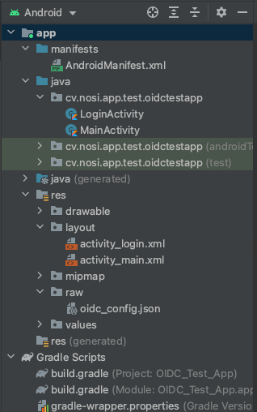
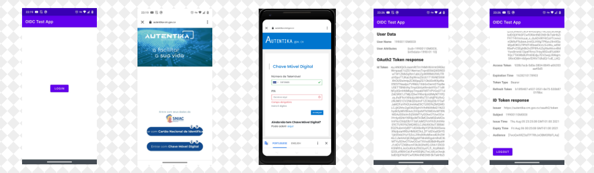

<h1 align="center">
 OIDC - Android Test Application
</h1>

<h2 align="center">
 Testing Asgardeo Android OIDC SDK
</h2>

## About
This repository contains de source code for a sample app testing the Asgardeo Android OIDC SDK to help implement OpenID authentication for "Chave Móvel Digital" (CMD) on Android mobile apps

## Development

### Platform and framework
* Android (*Kotlin*)
* Jetpack

### Versioning
* API Mínimo Android: 21
* Kotlin Gradle Plugin: 1.5.21
* Gradle Build Tools: 7.0.0
* Gradle: 7.0.2

### Repos
* google()
* mavenCentral()

## Asgardeo Android OIDC SDK implementation
The complete Asgardeo Android OIDC SDK documentation can be found [here](https://github.com/asgardeo/asgardeo-android-oidc-sdk), so here is shown the steps applied to implement the referred SDK.

### Directory Tree

The application contains the following directory tree.

### Build Gradle (:app)

#### Dependency

`implementation 'io.asgardeo.android.oidc.sdk:io.asgardeo.android.oidc.sdk:0.1.33'`

#### Manifest placeholder

`android.defaultConfig.manifestPlaceholders = [ appAuthRedirectScheme': 'nhacard' ]`

### OIDC Configuration

The OIDC main configuration is done by a `oidc_config.json` file located at `res\raw` with the content:

`{
"client_id": "7woQwhRZ3alTP7RhJxOBMORbFLAa",
"redirect_uri": "nhacard://login-callback",
"authorization_scope": "openid",
"discovery_uri": "https://autentika-cm.gov.cv"
}`

### AndroidManifest.xml

#### Permissions
The only required permission is to access the internet.

`<uses-permission android:name="android.permission.INTERNET" />`

#### Support for 30+ API
For Android devices running the API equal or bigger to 30 is necessary to add the next queries to the `<manifest>` tag.

`<queries>
    <intent>
        <action android:name="android.intent.action.VIEW" />
            <category android:name="android.intent.category.BROWSABLE" />
            <data android:scheme="https" />
    </intent>
    <intent>
        <action android:name="android.support.customtabs.action.CustomTabsService" />
    </intent>
</queries>`

### Activities

#### LoginActivity
Activity that calls the web view to do the login at `https://autentika-cm.gov.cv` through the `DefaultLoginService(this).authorize()` method from the Asgardeo SDK.
The action is called from a button click and the successIntent and the failureIntent are defined before the `authorize()` call.

`
findViewById<MaterialButton>(R.id.oidc_login).setOnClickListener {
    val completionIntent = Intent(this, MainActivity::class.java)
    val cancelIntent = Intent(this, LoginActivity::class.java)
    cancelIntent.putExtra("failed", true)
    cancelIntent.flags = Intent.FLAG_ACTIVITY_CLEAR_TOP
    val successIntent = PendingIntent.getActivity(this, 0, completionIntent, 0)
    val failureIntent = PendingIntent.getActivity(this, 0, cancelIntent, 0)
    DefaultLoginService(this).authorize(successIntent, failureIntent, true)
}
`

#### MainActivity
This Activity presents the user and login information present at `TokenManagementActivity.mAuthenticationContext` and also has a logout button that calls `DefaultLoginService(this).logout()`.

The `logout()` call doesn't return the logout result, so onResume calls a start LogoutActivity Intent.

### Sample Workflow

